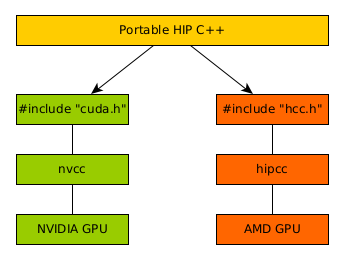
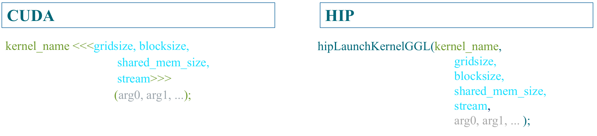

# Agenda (Times are in CET)

09:00 - 10:00 Introduction to AMD architecture and HIP  
10:00 - 10:15 Break  
10:15 - 10:45 Deep dive to Hipify tools and examples  
10:45 - 11:30 Lunch  
11:30 - 12:10 Hands-on sessions  
12:10 - 12:20 Break  
12:20 - 13:00 Hands-on sessions  

# Disclaimer
* AMD ecosystem is under heavy development
* All the experiments took place on NVIDIA V100 GPU (Puhti supercomputer)

# Motivation/Challenges
* LUMI will have AMD GPUs
* Need to learn how to port codes on AMD ecosystem
* Most of the material was prepared while there was no access to AMD hardware

# LUMI
{ .center width=77% }

# AMD GPUs (Mi100 example)
{ .center width=72% }

# Differences between HIP and CUDA
* AMD GCN hardware wavefronts size is 64 (warp on CUDA is 32)
* Some CUDA library functions do not have AMD equivalents
* Shared memory and registers per thread can differ between AMD and NVIDIA hardware

# ROCm
{ .center width=60% }

# ROCm Installation
* Many components need to be installed
* Rocm-cmake
* HSA Runtime API 
* ROCm LLVM/Clang
* ROCminfo (only for AMD HW)
* ROCM-Device-Libs
* ROCm-CompilerSupport
* ROCclr - Radeon Open Compute Common Language Runtime

# Introduction to HIP

* HIP: Heterogeneous Interface for Portability is developed by AMD to program on AMD GPUs
* It is a C++ runtime API and it supports both AMD and NVIDIA platforms
* HIP is similar to CUDA and there is no performance overhead on NVIDIA GPUs
* Many well-known libraries have been ported on HIP
* New projects or porting from CUDA, could be developed directly in HIP
* In some cases it is required to use AMD hardware for porting

# HIP Portability
 On a system with NVIDIA GPUs the hipcc, which is a compiler driver, will call the nvcc and not the hcc, as also a hip runtime will be included in the headers and it will be executed on NVIDIA GPU.
{ .center width=43% }


# Differences between CUDA and HIP API
{ .center width=87% }

# Differences between CUDA and HIP Launch Kernels
{ .center width=87% }

# HIP Terminology
|Term|Description|
|----|-----------|
|host|Executes the HIP API and can initiate kernel launches|
|default device|Each host maintains a default device. |
|active host thread|Thread running HIP API|
|HIP-Clang|Heterogeneous AMDGPU compiler 
|Hipify tools|Tools to convert CUDA code to HIP|
|hipconfig|Tool to report various configuration properties|

# HIP API

<div class="column">
* <font size="5"> Device management:</font>  
    * <font size="5">hipSetDevice(), hipGetDevice(), hipGetDeviceProperties()</font>  
- <font size="5"> Memory Management:</font>
    - <font size="5"> hipMalloc(), hipMemcpy(), hipMemcpyAsync(), hipFree()</font>

- <font size="5">Streams:</font>
    - <font size="5">hipStreamCreate(), hipSynchronize(), hipStreamSynchronize(), hipStreamFree()</font>

- <font size="5">Events:</font>
    - <font size="5">hipEventCreate(), hipEventRecord(), hipStreamWaitEvent(), hipEventElapsedTime()</font>
</div>

<div class="column">

- <font size="5">Device Kernels:</font>
    - <font size="5">\__global__, \__device__, hipLaunchKernelGGL()</font>

- <font size="5">Device code:</font>
    - <font size="5">threadIdx, blockIdx, blockDim, \__shared__</font>
    - <font size="5">Hundreds math functions covering entire CUDA math library</font>

- <font size="5">Error handling:</font>
    - <font size="5">hipGetLastError(), hipGetErrorString()</font>
</div>

# HIP Host memory visibility
<small>

|HIP API|Synchronization     effect|Fence    |Coherent Host Memory Visibility|Non-coherent Host Memory Visibility|
|-------|------------|---------|-------------------------------|-----------------------------------|
|hipStreamSynchronize|host waits for all commands in the specified stream| system-scope release| yes|yes|
|hipDeviceSynchronize|host waits for all commands across all streams of the device|system-scope release|yes|yes|
</small>


# HIP Host memory visibility (cont.)
<small>

|HIP API|Synchronization     effect|Fence    |Coherent Host Memory Visibility|Non-coherent Host Memory Visibility|
|-------|------------|---------|-------------------------------|-----------------------------------|
|hipEventSynchronize|host waits for specified event to complete|device-scope release|yes|depends|
|hipStreamWaitEvent|stream waits for specified event|none|yes|no|
</small>


# Libraries

{ .center width=100% }


# Hipify Tools

* Hipify tools convert automatically CUDA codes
* It is possible that not all the code is converted, the remaining needs the implementaiton of the developer
* Hipify-perl: text-based search and replace
* Hipify-clang: source-to-source translator that uses clang compiler

# Hipify-perl

* It can scan directories and converts CUDA codes with replacement of the cuda to hip
(sed –e ’s/cuda/hip/g’)
```bash
$ hipify-perl --inplace filename
```
* It modifies the filename input inplace, replacing input with hipified output, save backup in __.prehip__ file.
```bash
$ hipconvertinplace-perl.sh directory
```
It converts all the related files that are located inside the directory

# Hipify-perl (cont.)

```bash
$ ls src/
Makefile.am matMulAB.c matMulAB.h matMul.c
$ hipconvertinplace-perl.sh src
$ ls src/
Makefile.am matMulAB.c matMulAB.c.prehip matMulAB.h matMul.c matMul.c.prehip
```

No compilation took place, just conversion.

# Hipify-perl (cont.)

The hipify-perl will return a report for each file with the option `--print-stats`, and it looks like this:
```bash
info: TOTAL-converted 53 CUDA->HIP refs ( error:0 init:0 version:0 device:1 ... library:16
... numeric_literal:12 define:0 extern_shared:0 kernel_launch:0 )
warn:0 LOC:888
kernels (0 total) :
hipFree 18
HIPBLAS_STATUS_SUCCESS 6
hipSuccess 4
hipMalloc 3
HIPBLAS_OP_N 2
hipDeviceSynchronize 1
hip_runtime 1
```

# Hipify-perl (cont.)
{ .center width=100% }

# Hipify-perl (cont.)
{ .center width=100% }


# Compilation

1) Compilation with __CC=hipcc__

matMulAB.c:21:10: fatal error: hipblas.h: No such file or directory 21 | #include
"hipblas.h"

2) Install HipBLAS library 

3) Compile again and the binary is ready. When the HIP is on NVIDIA hardware with extension __.cpp__, then use the option "--x cu" after hipcc

# Megahip

* https://github.com/zjin-lcf/oneAPI-DirectProgramming
* 115 Applications/Examples with CUDA, SYCL, OpenMP offload and HIP
* Testing hipify tool, create a megahip script to convert all the CUDA examples to HIP
* ./megahip.sh
<small>
	* 3287 CUDA calls were converted to HIP
	* 115 applications totally 45692 lines of code, there are warnings for 4 of them, there are totally 24 warnings that something was wrong, check warnings.txt
	* Application Success (when bug* is fixed) 96.5217
	* Conversion Success (when bug* is fixed) 99.2699
</small>

\* https://github.com/ROCm-Developer-Tools/HIPIFY/issues/246

# Hipify-clang

* Build from source
*  Some times needs to include manually the headers -I/...
```bash
$ hipify-clang --print-stats -o matMul.o matMul.c
[HIPIFY] info: file 'matMul.c' statistics:
CONVERTED refs count: 0
UNCONVERTED refs count: 0
CONVERSION %: 0
REPLACED bytes: 0
TOTAL bytes: 4662
CHANGED lines of code: 1
TOTAL lines of code: 155
CODE CHANGED (in bytes) %: 0
CODE CHANGED (in lines) %: 1
20 TIME ELAPSED s: 22.94
```

# Benchmark MatMul OpenMP oflload

* Use the benchmark https://github.com/pc2/OMP-Offloading for testing purposes,
matrix multiplication of 2048 x 2048

* CUDA
```bash
matMulAB (11) : 1001.2 GFLOPS 11990.1 GFLOPS maxabserr = 0.0
```
* HIP
```bash
matMulAB (11) : 978.8 GFLOPS 12302.4 GFLOPS maxabserr = 0.0
```
* For the most executions, HIP version was equal or a bit better than CUDA version, for total
21 execution, there is ~2.23% overhead for HIP using NVIDIA GPUs

# N-BODY Simulation

N-Body Simulation (https://github.com/themathgeek13/N-Body-Simulations-CUDA)
AllPairs_N2

* 171 CUDA calls converted to HIP without issues, close to 1000 lines of code
* HIP calls: hipMemcpy, hipMalloc, hipMemcpyHostToDevice,
hipMemcpyDeviceToHost, hipLaunchKernelGGL, hipDeviceSynchronize, hip_runtime...
* 32768 number of small particles, 2000 time steps
* CUDA execution time: 68.5 seconds
* HIP execution time (on V100): 70.1 seconds, ~2.33% overhead

# N-BODY Simulation on Mi100

* CUDA execution time: 68.5 seconds
* HIP execution time (on V100): 70.1 seconds, ~2.33% overhead
* HIP execution time on Mi100: 95.57 seconds, 39.5% worse performance than V100

# N-BODY Simulation on Mi100

* CUDA execution time: 68.5 seconds
* HIP execution time (on V100): 70.1 seconds, ~2.33% overhead
* HIP execution time on Mi100: 95.57 seconds, 39.5% worse performance than V100
* Change the threads per workgroup from 1024 to 256

```
hipLaunchKernelGGL(interactBodies, dim3(nBlocks), dim3(1024), ...);

hipLaunchKernelGGL(interactBodies, dim3(nBlocks), dim3(256), ...);
```

* HIP execution time on Mi100: 54.32 seconds, 26.1% better performance than V100


# Fortran

* First Scenario: Fortran + CUDA C/C++
	- Assuming there is no CUDA code in the Fortran files.
	- Hipify CUDA
	- Compile and link with hipcc
* Second Scenario: CUDA Fortran
	- There is no HIP equivalent
	- HIP functions are callable from C, using `extern C`
	- See hipfort

# Hipfort

The approach to port Fortran codes on AMD GPUs is different, the hipify tool does
not support it.

* We need to use hipfort, a Fortran interface library for GPU kernel
* Steps:
	1) We write the kernels in a new C++ file
	2) Wrap the kernel launch in a C function
	3) Use Fortran 2003 C binding to call the C function
	4) Things could change
* Use OpenMP offload to GPUs

# Fortran SAXPY example


* Fortran CUDA, 29 lines of code
* Ported to HIP manually, two files of 52 lines, with more than 20 new lines.
* Quite a lot of changes for such a small code.
* Should we try to use OpenMP offload before we try to HIP the code?
* Need to adjust Makefile to compile the multiple files
* Example of Fortran with HIP: https://github.com/cschpc/lumi/tree/main/hipfort

# OpenMP or HIP

Some users will be questioning about the approach

* OpenMP can provide a quick porting but it is expected with HIP to have better performance as we avoid some layers like that.
* For complicated codes and programming languages as Fortran, probably OpenMP could provide a benefit. Always profile your code to investigate the performance.

# Porting codes to LUMI

{ .center width=70% }

# Profiling/Debugging

* AMD will provide APIs for profiling and debugging
* Cray will support the profiling API through CrayPat
* Some well known tools are collaborating with AMD and preparing their tools for
profiling and debugging
* Some simple environment variables such as
AMD_LOG_LEVEL=4 will provide some information.
* More information about a hipMemcpy error:
```bash
hipError_t err = hipMemcpy(c,c_d,nBytes,hipMemcpyDeviceToHost);
printf("%s ",hipGetErrorString(err));
```

# Programming Models

* OpenACC will be probably available through the GCC as Mentor Graphics (now called Siemens EDA) is developing the OpenACC integration

* Kokkos, Raja, Alpaka, and SYCL should be able to be used on LUMI but they do not support all the programming languages


# Hipify Gromacs

* GROMACS is a well-known molecular dynamics package
* This is an effort to hipify and not to execute on an optimized environment
* This showcases the procedure for a large application and possible issues
* No effort to optimize the code


# Hands-on Demonstration { .center }

* View instructions: https://hackmd.io/okbEtY7iTYaCJjkg-EZh1Q
* Ask question (at the end of the document below the feedback title): https://hackmd.io/okbEtY7iTYaCJjkg-EZh1Q?both
